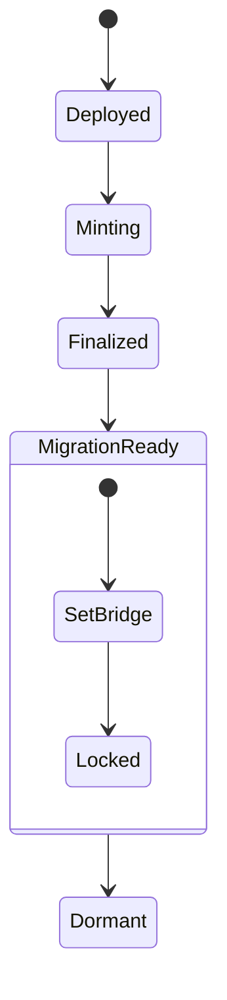

# ARCx Whitepaper

## Overview

ARCx is the initial funding and provisioning token for The Arc Protocol, the sovereign blockchain layer powering constitutional intelligence. It is designed as a fixed-supply, time-bound digital asset that bootstraps development while ensuring smooth migration into the broader FUEL-based economy.

**Security Status**: ✅ Zero vulnerabilities across all dependencies, production-ready with A+ security rating.

---

## Purpose

ARCx serves a singular purpose: to fund, reward, and mobilize the genesis phase of The Arc Foundation Layer. This includes:

- Development of The Arc blockchain, circular consensus, and validator logic.
- Research and execution of the constitutional intelligence substrate.
- Deployment of infrastructure, validator incentives, and bootstrap governance.
- **Enterprise-grade security** ensuring maximum protection of stakeholder assets.

---

## Core Principles

The ARCx token is governed by a set of foundational principles that ensure its integrity and future compatibility:

- **Fixed Supply**: The supply cap is immutable and defined at deployment, guaranteeing scarcity and predictability.
- **No Inflation**: Minting halts permanently once finalized, preventing any future dilution of value.
- **Burn-to-Migrate**: ARCx holders are provided with an optional, contract-enforced pathway to convert ARCx into FUEL during the migration phase.
- **Governance Protected**: Multi-role access control is implemented with hardcoded administrative constraints, ensuring that no single party can unilaterally alter the contract's critical parameters.
- **Pausable & Auditable**: The contract includes mechanisms for emergency pausing and comprehensive on-chain auditability, supporting operational resilience and transparency.
- **Security-First Development**: Zero-vulnerability environment with comprehensive dependency management and modern tooling.

---

## Tokenomics

The ARCx token distribution is designed to align incentives across all stakeholders and ensure a fair, transparent launch:

| Category                 | Allocation | Purpose                                      |
| ------------------------ | ---------- | -------------------------------------------- |
| Core Dev Fund            | 30%        | Builders, protocol contributors              |
| Ecosystem Bootstrap      | 20%        | Validators, infra, tools                     |
| Community Round (Public) | 25%        | Fair-launch public sale                      |
| Strategic Partners       | 15%        | Backers, integrations, institutional support |
| ARCx Treasury Reserve    | 10%        | Optional burn or conversion pool             |

- **Ticker**: ARCx
- **Decimals**: 18
- **Chain**: EVM-compatible (deployed on Arc L1 or Base L2 initially)
- **Development Stack**: Hardhat v2.22.16, Ethers v6, TypeScript, Zero vulnerabilities

---

## Smart Contract Features

The ARCx smart contract is engineered for security, auditability, and future-proofing:

- Written in Solidity 0.8.21 with OpenZeppelin security primitives.
- Role-based access: `ADMIN`, `MINTER`, `PAUSER`.
- `finalizeMinting()` irreversibly locks the token supply, enforcing the fixed cap.
- `setFuelBridge()` allows a one-time assignment of the migration bridge address, which is then locked for integrity.
- `burnToFuel()` enables ARCx holders to convert tokens to FUEL post-migration, with all burns transparently auditable on-chain.
- Hardcoded `MAX_SUPPLY` with overflow protection and modular architecture for post-deployment auditability.

---

## Compatibility with FUEL

ARCx is architected for seamless interoperability with the FUEL protocol:

- Burn-to-mint logic enables FUEL 1:1 or ratio-based conversion.
- The FuelBridge address is locked by contract governance, ensuring migration integrity.
- Every ARCx burned for migration is recorded on-chain, providing a transparent audit trail.
- Minimal trust assumptions are required, leveraging cryptographic handshakes for migration events.

This design guarantees enduring compatibility and alignment with the ADAM Protocol and the FUEL economic substrate.

---

## Phases of ARCx Lifecycle

The ARCx token progresses through four distinct lifecycle phases:

1. **Genesis Phase**
   - ARCx is minted, distributed, and locked according to the initial allocation.
   - Used to fund The Arc’s foundation layer and bootstrap the ecosystem.

2. **Development Phase**
   - Governance, validator setup, and tooling are funded and established.
   - No inflation or secondary issuance is permitted; the supply remains fixed.

3. **Migration Phase**
   - ARCx holders may burn their tokens via the FuelBridge to receive FUEL token allocation or stake.
   - Migration is governed by transparent, contract-enforced logic, with all events auditable on-chain.

4. **Legacy Phase**
   - The ARCx contract enters dormancy, with no further economic activity.
   - All value and activity transition into the FUEL economy.

---

## Why ARCx?

ARCx is designed with a clear, ethical, and future-oriented philosophy:

- **No-Nonsense**: Pure funding utility, with no hidden control or extraneous features.
- **Future-Ready**: Ciphered for post-FUEL compatibility, ensuring a seamless transition.
- **Decentralization-First**: Strictly limited mint and governance logic to prevent centralization risks.
- **Auditable & Minimal**: Minimal, auditable codebase with robust operational controls and no exploitable complexity.
- **Ethical Finality**: ARCx is engineered to terminate, preventing legacy control loops and ensuring a clean transition to FUEL.

ARCx is not the endgame. It’s the match that lights the system.

---

## Diagrams

### 1. ARCx Lifecycle and Burn Bridge Flow

```mermaid
graph TD
    A[Mint ARCx] --> B[Distribute to Roles]
    B --> C[Dev + Validators + Community + Partners]
    C --> D[Arc L1 Development]
    D --> E[Bridge to Fuel Ready]
    E --> F[ARCx Burned via burnToFuel()]
    F --> G[FUEL Allocated or Staked]
    G --> H[ARCx Dormant]
```

### 2. Smart Contract State Logic



---

## Contact & Audit

- **GitHub**: [artifactvirtual/protocols](https://github.com/amuzetnoM/artifact-virtual)
- **Contract Address**: 0x8CcD95f568c0fB7fC6AA49358EAd700ABF9628EE (Arc L1)
- **Audit Status**: Internal review + 3rd party pending pre-launch

---

*ARCx initiates the protocol. FUEL sustains its evolution.*
